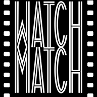
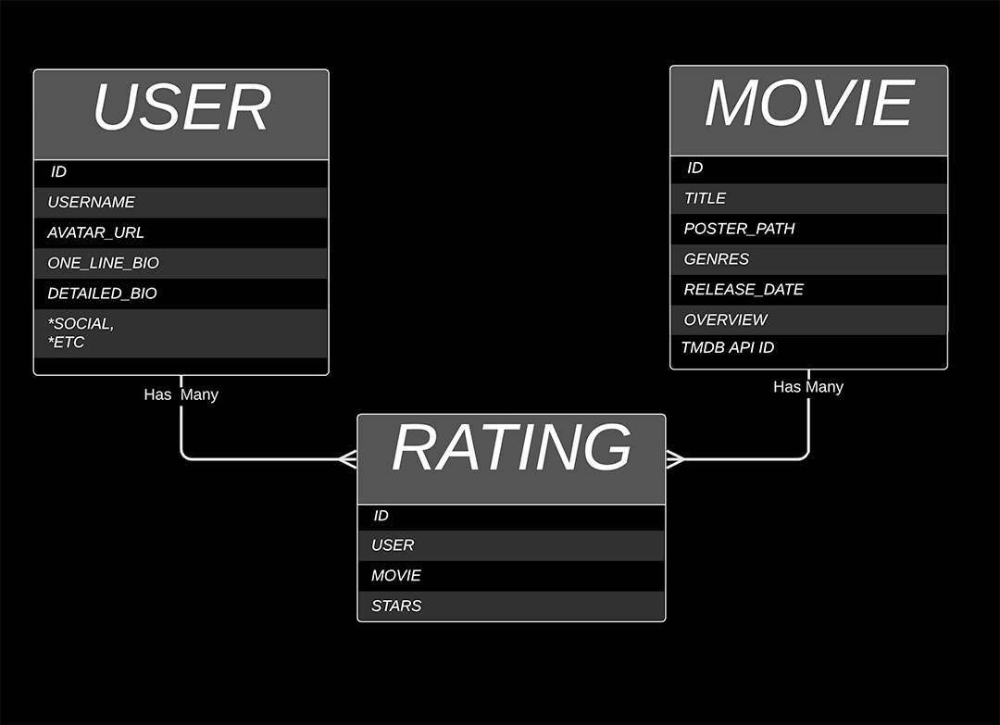

# WATCHMATCH backend

Created as a final project for Flatiron School Software Engineering bootcamp, and continuing to be worked on and improved, to continue learning.

WATCHMATCH is a webapp which matches users based on how they rate movies. Users can rate movies on a scale from 1/2 star to 5 stars. The ratings of all movies any two users have both rated are compared to each other on a weighted logarithmic scale and then averaged to find a maximum possible compatibility percentage of the users' tastes. In addition, the percentage is adjusted by a margin of error based on how many rated movies the users have in common. This method was inspired by the algorithm used on OKCupid. ([Inside OKCupid: The math of online dating](https://www.ted.com/talks/christian_rudder_inside_okcupid_the_math_of_online_dating/transcript?language=en))

For more information on the frontend, please see [watchmatch-frontend](https://github.com/jasonchilcott/watchmatch-frontend)

WATCHMATCH is currently live at https://watchmatch.herokuapp.com/
## Technologies Used

- Ruby on Rails - The backend of WATCHMATCH was written in Rails. This includes the database migrations, routes, serializers, models, and controllers.

The match percentages are calculated on the frontend currently.

- [TMDb API](https://developers.themoviedb.org/3) - External API used for movie information and poster images.  Movies are queried from the frontend, then sent to the backend to ensure they are already in the WATCHMATCH database by checking their id from the TMDb API first, to prevent duplicate movies.

## Issues & Solutions

...